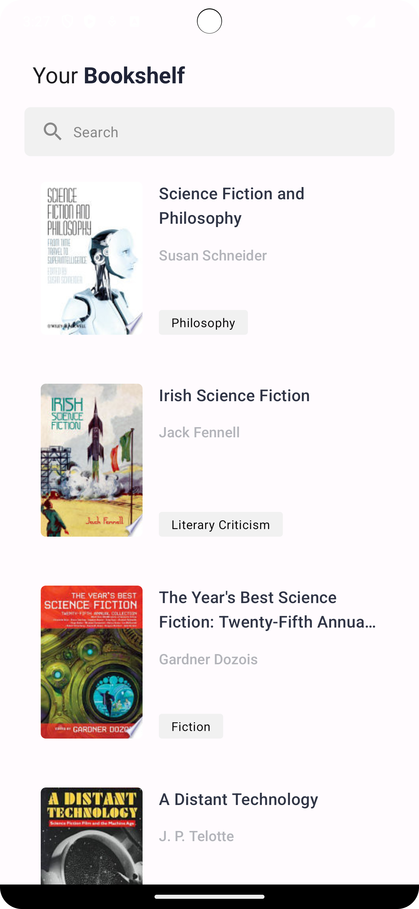
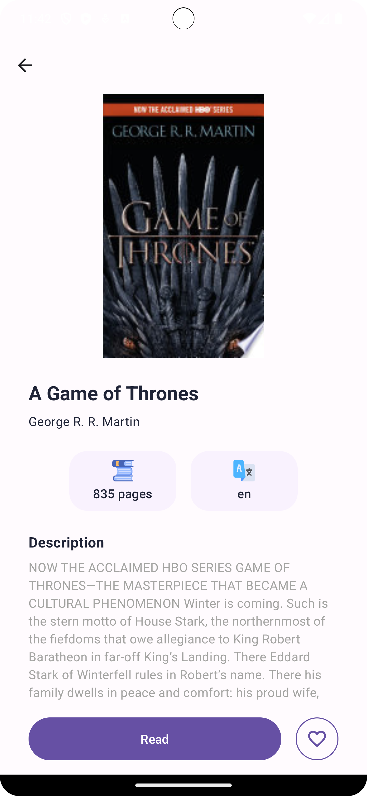
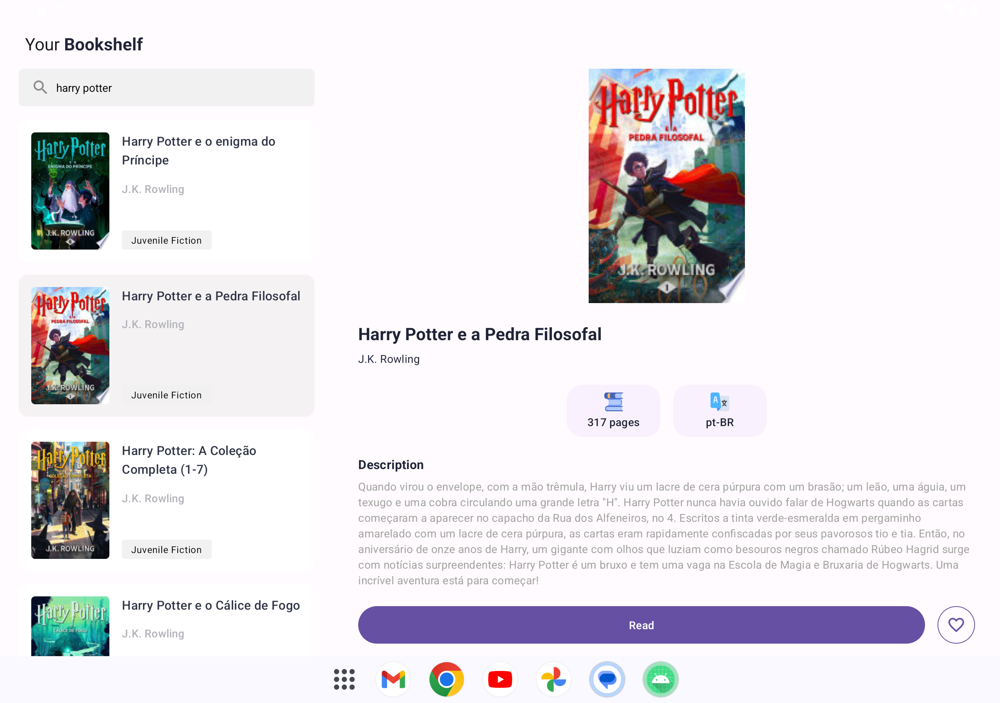

Bookshelf app
=================================

Bookshelf app is a demo app that displays a list of books and its details with images from the Google Books API.

The data is stored on a Web server as a REST web service.

This app demonstrated the use of Retrofit to make REST requests to the web service, kotlinx.serialization to handle the deserialization of the returned JSON to Kotlin data objects, and Coil to load images by URL.

It's developed using Jetpack Compose components like ```Column```, ```Button```, ```Text```, ```Image```, and ```Modifier```.

<p align="center">
  
  
  
</p>

<p align="center">
  
</p>

Getting Started
---------------
1. Install Android Studio, if you don't already have it.
2. Download the sample.
3. Import the sample into Android Studio.
4. Build and run the sample.

Resources
---------------
Thank you for providing free images 😍

- <a href="https://www.flaticon.com/br/icones-gratis/livros" title="livros ícones">Livros ícones criados por piksart - Flaticon</a>

- <a href="https://www.flaticon.com/br/icones-gratis/extensible-markup-language" title="extensible markup language ícones">Extensible markup language ícones criados por Freepik - Flaticon</a>
